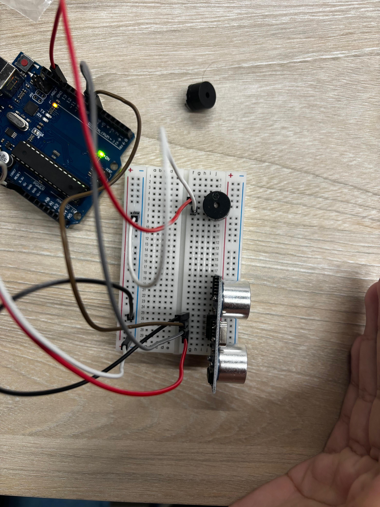

# 🦯 SafeWalk

O **SafeWalk** é uma bengala inteligente desenvolvida para auxiliar pessoas com deficiência visual a se locomoverem com mais segurança.  
Ele utiliza um **sensor ultrassônico** para detectar obstáculos à frente e um **buzzer** que emite sinais sonoros, variando em **frequência e velocidade dos bipes** conforme a distância do obstáculo — funcionando de forma semelhante a sensores de estacionamento automotivos.

---

## 🚀 Funcionalidades
- Detecção de obstáculos até **1 metro de distância**.  
- Alerta sonoro no **buzzer**: quanto mais próximo o obstáculo, mais rápido e mais agudo é o som.  
- Protótipo desenvolvido e testado no **Tinkercad**.  
- Versão física construída em **Arduino** e integrada à bengala real.  

---

## 🛠️ Tecnologias Utilizadas
- **Arduino UNO**  
- **Sensor Ultrassônico HC-SR04**  
- **Buzzer Piezoelétrico**  
- Protoboard, jumpers e alimentação 5V  

---

## 📸 Imagens do Projeto

### 🔧 Protótipo no Tinkercad

### ✅ Versão final construída

---

## 📂 Estrutura do Código
- Leitura de distância pelo **HC-SR04**.  
- Conversão do tempo de eco para **centímetros**.  
- Controle do buzzer via `tone()` com base nas faixas de proximidade.  

---

## 📌 Futuras Melhorias
- Adicionar **motor vibratório** como alternativa ao som.  
- Integrar com **GPS** para auxílio em navegação.  
- Criar uma versão com **bateria recarregável e design compacto**.  

---

## 👤 Autor
Projeto desenvolvido por **Rafael Diniz** como protótipo de sistema embarcado, com foco em acessibilidade e tecnologia assistiva.  
